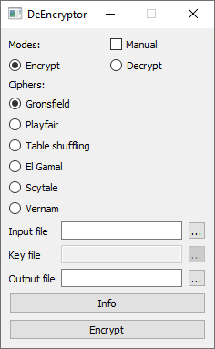
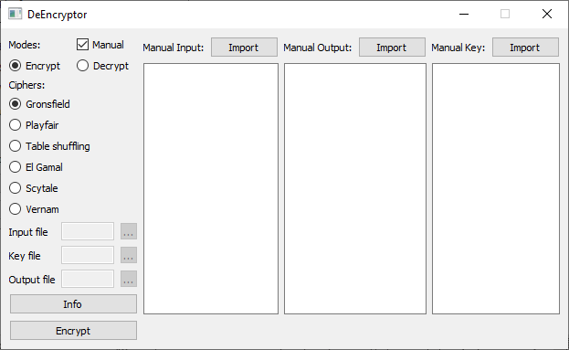
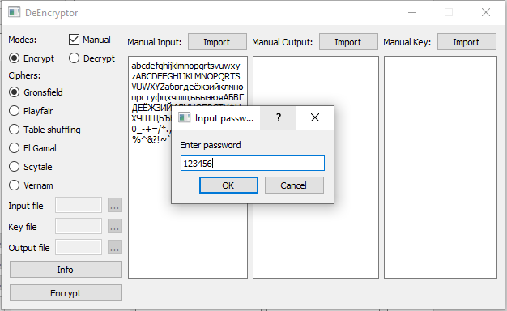
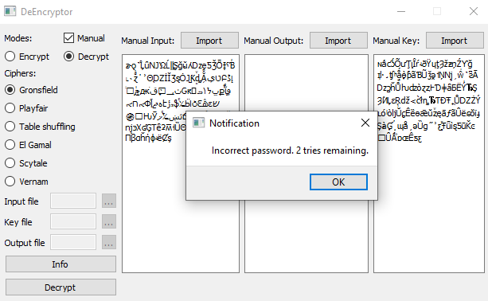
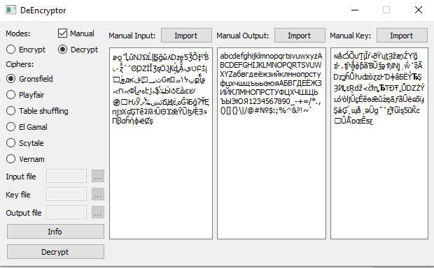

# RGR_ABS123_Nikiforov_Poduto_Morozov
Группа АБс-123
Тема Расчётно-графической работы: разработка криптографического программного обеспечения.

Никифоров Максим

Начал работу в конце Февраля. Реализовал идеальную шифровку Гронсфельда и близкую к идеальной Плейфеира и вариацию табличной шифровки - тройной табличной перестановки.
29.05.2022 - Весь рефактор функций, графический интерфейс, readme мои.

Подуто Егор

Начал работу 3 апреля. Реализованы шифр Вернама и Скитала. В процессе реализации шифр Эль-Гамаля.

Пример работы:
1. Запустить ui.py и выбрать алгоритм шифрования.

2. Выбрать режим ручного ввода Manual.

3. Ввести текст в колонку "Manual Input" или импортировать его с помощью кнопки Import и нажать кнопку Encrypt, ввести пароль.

4. После ввода пароля программа зашифрует введенный текст и выдаст ключ в колонке "Manual Key".

Все данные (шифрованный текст, ключ и пароль) будут сохранены в файле logs.txt

Для дешифровки:

5. Сменить режим на "Decrypt", вырезать содержимое колонки "Manual Output" и заменить им Manual Input. Нажать кнопку Decrypt. Будет запрошен пароль.

6. Если пароль будет введен неправильно то, появится предупреждение о количестве оставшихся попыток. Если пароль введен правильно, то процесс завершится и в колонку Manual Output будет введен результат дешифровки. 

 

Работа в режиме использования файлов в целом аналогична. 
Ключевые отличия: путь к файлу-ключу нельзя ввести, вместо этого создается файл с именем файла ввода + "_key.txt" (пример: "1.txt" -> "1_key.txt")
